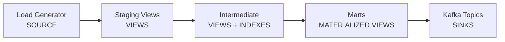

# Materialize Concepts in This Project

This guide explains how key Materialize concepts are demonstrated in this dbt project, with links to the official Materialize documentation for deeper learning.

## Table of Contents
- [Views](#views)
- [Materialized Views](#materialized-views)
- [Sources](#sources)
- [Sinks](#sinks)
- [Indexes](#indexes)

---

## Views

**Materialize Documentation:** [Views Overview](https://materialize.com/docs/sql/create-view/)

Views in Materialize are virtual tables that store a query but not the data itself. They're recomputed on each access, making them ideal for transformations where you don't need persistent results.

### Examples in This Project:

#### Staging Layer (Simple Views)
All staging models are implemented as views for efficient data transformation without storage overhead:

- [`models/staging/stg_accounts.sql`](models/staging/stg_accounts.sql) - Basic column aliasing and renaming
- [`models/staging/stg_bids.sql`](models/staging/stg_bids.sql) - Simple data type casting
- [`models/staging/stg_auctions.sql`](models/staging/stg_auctions.sql) - Field selection and standardization

```sql
-- Example from stg_bids.sql
{{ config(materialized='view') }}

SELECT
    id AS bid_id,
    buyer AS buyer_account_id,
    auction_id,
    bid_amount,
    bid_time
FROM {{ source('auction', 'bids') }}
```

#### Intermediate Layer (Complex Views with Indexes)
More sophisticated transformations that benefit from indexed access:

- [`models/intermediate/int_winning_bids.sql`](models/intermediate/int_winning_bids.sql) - **Indexed view** using window functions
- [`models/intermediate/int_user_activity_summary.sql`](models/intermediate/int_user_activity_summary.sql) - Multi-way joins and aggregations
- [`models/intermediate/int_auction_flips.sql`](models/intermediate/int_auction_flips.sql) - Self-joins with temporal logic

**Key Learning:** Views are perfect for transformations that don't require persistence, saving compute and storage resources.

---

## Materialized Views

**Materialize Documentation:** [Materialized Views](https://materialize.com/docs/sql/create-materialized-view/)

Materialized views maintain query results in memory and automatically update as underlying data changes. They provide real-time, consistent results without recomputation.

### Examples in This Project:

#### Analytics Models (Marts Layer)
All mart models use materialized views for real-time analytics:

- [`models/marts/fct_auction_flippers.sql`](models/marts/fct_auction_flippers.sql) - **Flipper detection and categorization**
  - Maintains real-time flipper metrics
  - Automatically updates as new flips are detected
  - Categories update dynamically based on activity

- [`models/marts/metrics_auction_health.sql`](models/marts/metrics_auction_health.sql) - **Platform health monitoring**
  - Hourly metrics maintained in real-time
  - Aggregations incrementally updated
  - No batch recomputation needed

- [`models/marts/realtime_suspicious_activity.sql`](models/marts/realtime_suspicious_activity.sql) - **Real-time alerting**
  - Suspicious patterns detected instantly
  - Alert states maintained continuously

```sql
-- Example from fct_auction_flippers.sql
{{ config(
    materialized='materializedview',
    cluster='compute'
) }}

WITH flipper_stats AS (
    -- Complex aggregation logic
    SELECT 
        account_id,
        COUNT(*) as total_flips,
        AVG(EXTRACT(EPOCH FROM time_to_flip)/86400) as avg_days_to_flip
    FROM {{ ref('int_auction_flips') }}
    GROUP BY account_id
)
-- Results maintained in memory and updated automatically
```

**Key Learning:** Materialized views eliminate the latency of complex queries by maintaining results that update automatically as source data changes.

---

## Sources

**Materialize Documentation:** [Sources](https://materialize.com/docs/sql/create-source/)

Sources ingress data into Materialize from external systems. This project demonstrates the LOAD GENERATOR source for creating synthetic streaming data.

### Examples in This Project:

#### Load Generator Source
- [`models/sources/auction_load_generator.sql`](models/sources/auction_load_generator.sql) - **Creates streaming auction data**

```sql
CREATE SOURCE {{ this }}
IN CLUSTER sources
FROM LOAD GENERATOR AUCTION (
    TICK INTERVAL '1s',  -- Generate new events every second
    AS OF 100000         -- Start from timestamp 100000
)
FOR ALL TABLES
```

This creates five subsources automatically:
- `accounts` - User account data
- `auctions` - Auction listings
- `bids` - Bid events (streaming)
- `users` - User profiles  
- `organizations` - Company data

#### Source Configuration
- [`models/staging/_sources.yml`](models/staging/_sources.yml) - **dbt source definitions**
  - Defines schema tests for data quality
  - Documents all source columns
  - Establishes relationships between tables

**Key Learning:** Sources are the entry point for streaming data, creating tables that automatically update as new data arrives.

---

## Sinks

**Materialize Documentation:** [Sinks](https://materialize.com/docs/sql/create-sink/)

Sinks export data from Materialize to external systems like Kafka, maintaining real-time data pipelines.

### Examples in This Project:

All sinks are in the [`models/sinks/`](models/sinks/) directory:

#### Kafka Sinks with DEBEZIUM Envelope
- [`sink_flippers_to_kafka.sql`](models/sinks/sink_flippers_to_kafka.sql) - **Exports flipper data**
  ```sql
  CREATE SINK {{ this }}
  IN CLUSTER sinks
  FROM {{ ref('fct_auction_flippers') }}
  INTO KAFKA CONNECTION kafka_connection (
      TOPIC 'auction-flippers'
  )
  FORMAT JSON
  ENVELOPE DEBEZIUM  -- Includes before/after change data
  ```

- [`sink_alerts_to_kafka.sql`](models/sinks/sink_alerts_to_kafka.sql) - **Streams suspicious activity alerts**
  - Real-time fraud detection alerts
  - Pushes to `suspicious-activity-alerts` topic

- [`sink_metrics_to_kafka.sql`](models/sinks/sink_metrics_to_kafka.sql) - **Exports platform metrics**
  - Continuous metrics streaming
  - Pushes to `auction-health-metrics` topic

#### Sink Configuration
```yaml
# In dbt_project.yml
vars:
  sink_cluster: 'sinks'  # Dedicated cluster for sink operations
```

**Key Learning:** Sinks enable real-time data export, creating continuous pipelines that push changes to downstream systems as they occur.

---

## Indexes

**Materialize Documentation:** [Indexes](https://materialize.com/docs/sql/create-index/)

Indexes on views enable efficient point lookups and improve join performance. Materialize automatically maintains indexes as data changes.

### Examples in This Project:

#### Indexed Intermediate View
- [`models/intermediate/int_winning_bids.sql`](models/intermediate/int_winning_bids.sql) - **Multi-column indexing strategy**

```sql
{{ config(
    materialized='view',
    indexes=[
      {'columns': ['auction_id']},        # Primary lookup
      {'columns': ['winner_account_id']}, # Join optimization
      {'columns': ['seller_account_id']}  # Join optimization
    ]
) }}
```

This creates three indexes:
1. `int_winning_bids_auction_id_idx` - Fast auction lookups
2. `int_winning_bids_winner_account_id_idx` - Optimizes buyer analysis joins
3. `int_winning_bids_seller_account_id_idx` - Optimizes seller analysis joins

#### Verifying Indexes
```sql
-- Query to see all indexes on a view
SELECT name, on_id 
FROM mz_indexes 
WHERE on_id = (
    SELECT id FROM mz_relations 
    WHERE name = 'int_winning_bids'
);
```

#### Performance Impact
The indexed `int_winning_bids` view is referenced by:
- `int_user_activity_summary` - Joins on winner_account_id
- `int_auction_flips` - Joins on auction_id
- Multiple mart models - Various join patterns

**Key Learning:** Indexes dramatically improve query performance for views, especially for joins and filtered queries, with Materialize maintaining them automatically.

---

## Architecture Overview



### Resource Separation with Clusters

The project demonstrates cluster separation for workload isolation:

```sql
-- Sources run on dedicated cluster
CREATE CLUSTER sources REPLICAS (r1 (SIZE = '25cc'));

-- Transformations on compute cluster  
CREATE CLUSTER compute REPLICAS (r1 (SIZE = '25cc'));

-- Sinks on separate cluster
CREATE CLUSTER sinks REPLICAS (r1 (SIZE = '25cc'));
```

This ensures:
- Source ingestion doesn't impact query performance
- Complex computations are isolated
- Sink operations don't affect analytics

---

## Running the Examples

### Quick Start
```bash
# Start Materialize and Kafka
docker compose up -d

# Create sources
dbt run --selector sources_only --profiles-dir . --profile materialize_auction_house

# Build views and materialized views
dbt run --profiles-dir . --profile materialize_auction_house

# Create sinks
dbt run --selector sinks_only --profiles-dir . --profile materialize_auction_house
```

### Explore the Concepts
```sql
-- Connect to Materialize
psql "postgresql://materialize@localhost:6875/materialize"

-- Watch real-time updates in a materialized view
COPY (SUBSCRIBE (SELECT * FROM public_marts.fct_auction_flippers)) TO STDOUT;

-- Check index performance
EXPLAIN SELECT * FROM public_intermediate.int_winning_bids WHERE auction_id = 123;
```

---

## Additional Resources

- [Materialize Documentation](https://materialize.com/docs/)
- [dbt-materialize Adapter](https://github.com/MaterializeInc/dbt-materialize)
- [Materialize Cloud Console](https://console.materialize.com/)
- [Materialize Community Slack](https://materialize.com/community/)